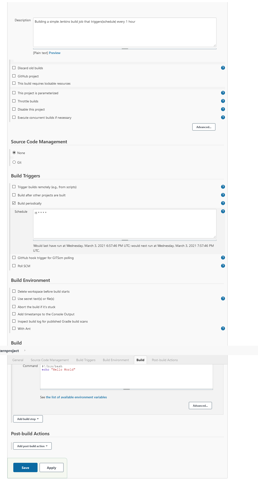

# Dev-Ops-Task
#Task Completed
###  A Simple Jenkins Build Job That Triggers(Schedule) Every 1 Hour.
#### 1. Build the docker image in docker  (all commands to run Jenkinsdocker file  are listed in the commands.txt file)
#### 1. Copy the initalAmdminpassword 
#### 2. open localhost:8080 on your browser and follow the instruction in screenshots in src folder to complete a task.

 
# Source help

https://github.com/jenkinsci/docker <br/ >
https://www.jenkins.io/doc/book/installing/ <br/ >
https://www.jenkins.io/doc/book/installing/docker/ <br/ >
https://phoenixnap.com <br/ >

